# Milestone Project 4 : Far East Car Care Ltd, an online shopping site proposal for car-care products.

### By: Brian Smyth

[Live FECC Website](https://bxs-fecc-ms4.herokuapp.com/)

# Index

- [**UX**](#ux)

- [**Skeleton**](#skeleton)

- [**Scope**](#scope)

- [**Surface**](#surface)

- [**Testing**](#testing)

- [**Deployment**](#deployment)

- [**Resources**](#resources)

- [**Credits**](#credits)

---
---

## Introduction : Why should this website exist?

Car care is a strongly growing business at present with a large pool of car enthusiasts as the primary customers, along with a smaller pool of car-care professionals who use products daily. This aspect of the business is strongly both visual and kinesthetic. To elaborate on this, car enthusiasts love beautiful looking cars, it appeals to their visual senses and emotions. Most also enjoy working on their own cars, putting great efforts into mechanical maintenance and care/appearance maintenance. The result is appreciated far more than the personal effort. 

While there are a lot of brands and products available, the most advanced ranges come from the Far East. There is a greater access to industrial grade chemicals from a broader field of innovation, which is pipelined into the automotive product sector. Their products are easier to use, more durable and look better than most European or American brands. The greatest obstacle to the car enthusiast based in Europe or USA is that they can't speak nor read Japanese, so the translation of product labels provides a huge barrier to purchasing. 

Too make it easier for the average enthusiast, this website will provide easy access to a range of Japanese car products which are of high quality and easily understood in their purpose. The website will be mainly a business-to-consumer website with an easy to follow categorisation of products. Users will be easily able to browse and select products by adding them to a shopping cart where they can then make a credit-card purchase through a secure online-purchase resource. The products will then be dispatched within 24 hours. 

Ancillary objectives for the site owners will be to offer an email subscription service with tips and tricks for product use, special offers and a feature for new/coming-soon product developments. 

# UX

## UX : The Strategic approach for the site's User Experience: 

The site will entice the users through educational and instructional blog posts along with images of cars that have the site's products used on them. First and foremost, there must be both visual and educational appeal set apart from the actual products in the store. 

Upon landing on the index page, the user will be introduced with an attractive car image at the top, along with some featured blog posts in the main body of the page. There will be links to the store both in the body and at both the top navigation bar and the always-present sliding side navigation. 

Adjuvant site pages will be the Blog and posts pages, the About page, the Frequently Asked Questions, and the Contact page.

Site Navigation will be through a side-sliding menu on the left. The Icon actuator will be clearly visible at the top right of the page for the user to click on.

On mobile devices, the sliding navigation bar will the main tool for traversing the site, however the account button (to login or register) and the cart will always be available in the top right of every device.

## Who are the target Users?

- Car Enthusiasts. 
- The target age-group for customers of the website is 18 to 70 years old as car lovers always enjoy working on their cars, regardless.
- Car Wax Enthusiasts, who are actually a subset of car enthusiasts with large collections of car care products in their garages.
- Detailing & Car Care Hobbyists - those who spend their weekends cleaning and polishing their family's and friend's cars for extra income. 
- Average Car Owners, the owners who prefer to wash and wax their own cars without necessarily being enthusiastic about the engine or performance. 
- Car Detailing & Valeting Professionals who use quality products on their clients' cars. 
- Motorcycle Enthusiasts, as they also like to keep their bikes pristine.
- Truck Enthusiasts.
- Spouses and Relatives of Car Enthusiasts who may wish to purchase gifts. 
 
## Research 

- There are a handful of small business who sell a very broad range of car care products online.
- There are also larger Bulk chemical companies who specialise in car trade product sales, for dealers and car-wash centres, etc.
- There is a very small supply of Japanese or other Asian products and some of these are low quality. 
- Most car owners are unaware of car care products variability, the quality of them and what they are actually designed to do. 
- Most products are bought in general because of the marketing and merchandising on chain-store shelves. 
- Most products are bought because they are cheap.
- Car enthusiasts are more likely to discuss and compare products at social gatherings, car club meets, car shows. 
- Enthusiasts will share photos of their cars and product purchases on Social Media, forums, etc.
- Ease-of-use, durability and the finish delivered by the product are more important than competitive pricing. 

## Important Site Features for the users

- The Blog will contain posts created in categories such as News, Tips & Tricks, Products, Professional Advice, Special Offers. 
- Blog Posts will allow registerd users to leave comments. 
- Each post will display Number of Views, Number of Comments, When it was written. 
- User Accounts : Create Unique login and password for returning clients
- Securely stored customer data : Address and billing information
- Ability to edit data such as name, address, telephone, email in the account.
- Secure Financial Transactions 
- Ability to browse products and Read pertinent data
- A shopping cart to Update with planned purchases
- Company information Page
- Frequently Asked Questions
- A resource to submit queries
- A Subscription for regular updates and offers
- The ability to update their purchase choices
- A Product rating system
- A list of reviews from other customers on each product. 
- Real-time confirmation of actions such as "Added to Cart", "Item Deleted", etc
- The ability access products by pre-selected category (Exterior, Interior, Accessory products, etc)
- The ability to select or filter products by price. 
- A convenient Search utility.
- Social Media links
- Shopping Cart button link
- The ability to subscribe to the newsletter without having an account
- Buttons to keep shopping after adding to cart or viewing the cart

## Business Goals for the site

- The site owner purchases in bulk and sells individual items at a profit
- The site and products will be marketed on Social Media
- The service will be more attractive than local competitors through ease of access, after-sales support, pre-sales advice and frequent blog posts.  
- Products will be dispatched efficiently, attractively and safely wrapped and securely boxed with invoice and address paperwork attached to the exterior.
- The business will strive for positive feedback, both for products and service.

__________
__________

 

[Back to Top :arrow_up:](#table-of-contents)

## User Story Aspirations
- Please Click to expand 

User Story Sheet 1

User Story Sheet 2

__________
__________

# Skeleton

## Skeleton Outlay

The following mock-ups were drawn up using Balsamiq Wireframe Editor Early in the project but save here as images: 

Landing Page

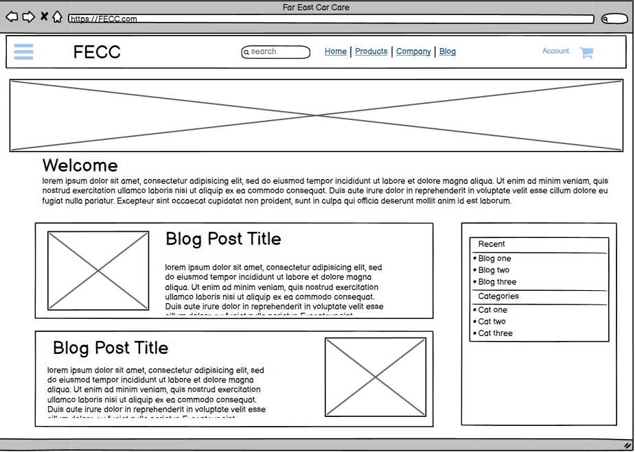

Blog Page

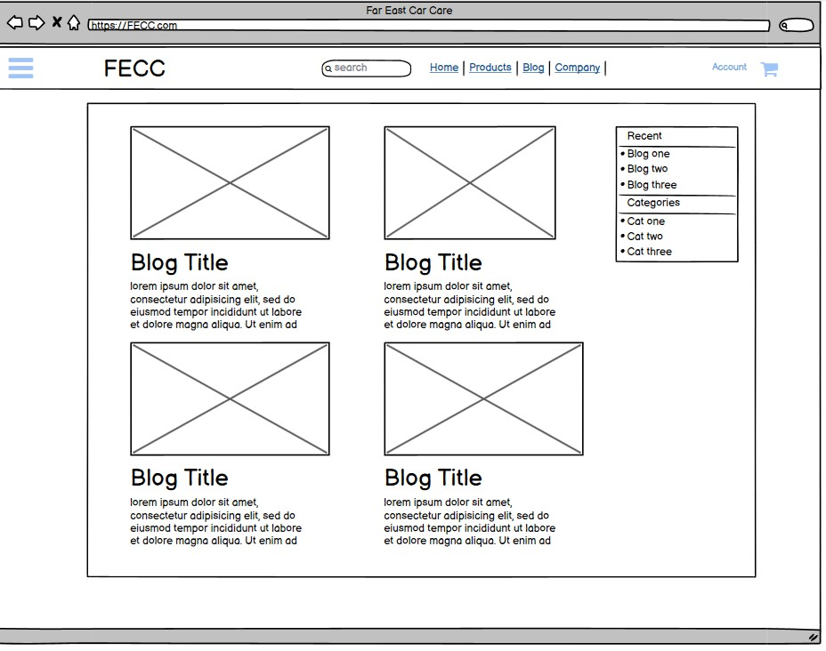

Blog Post

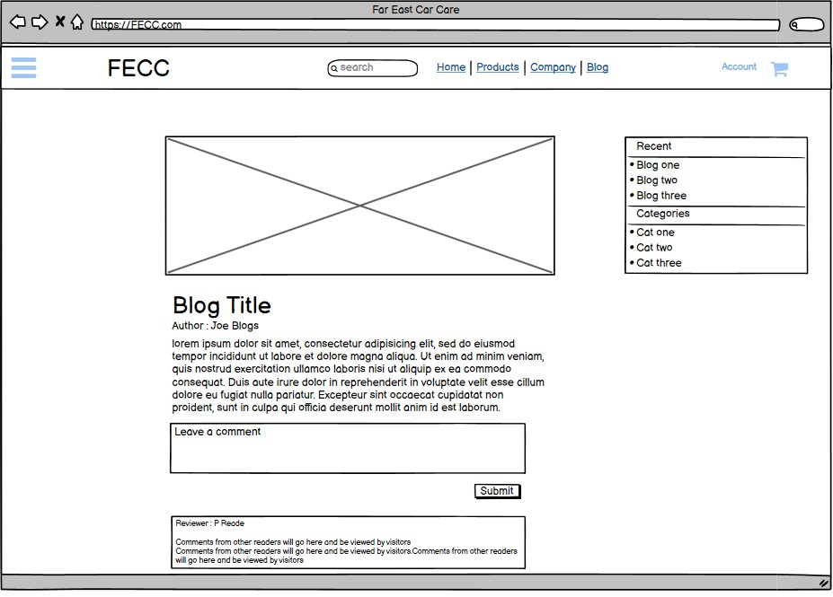

Products Page

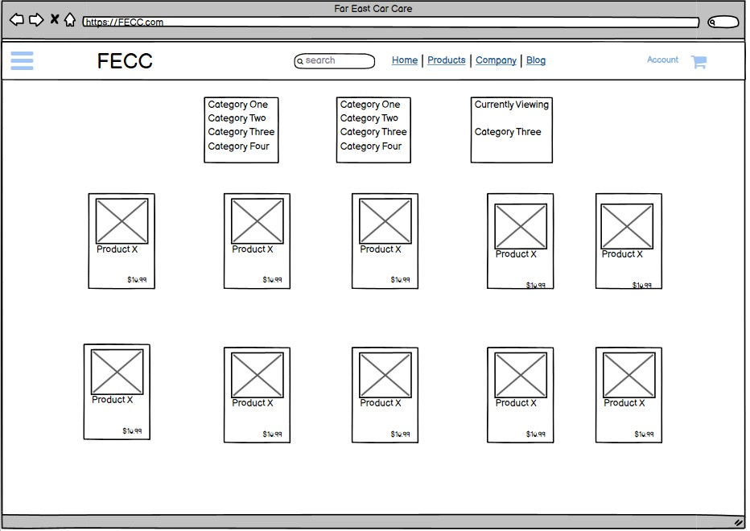

Product Detail

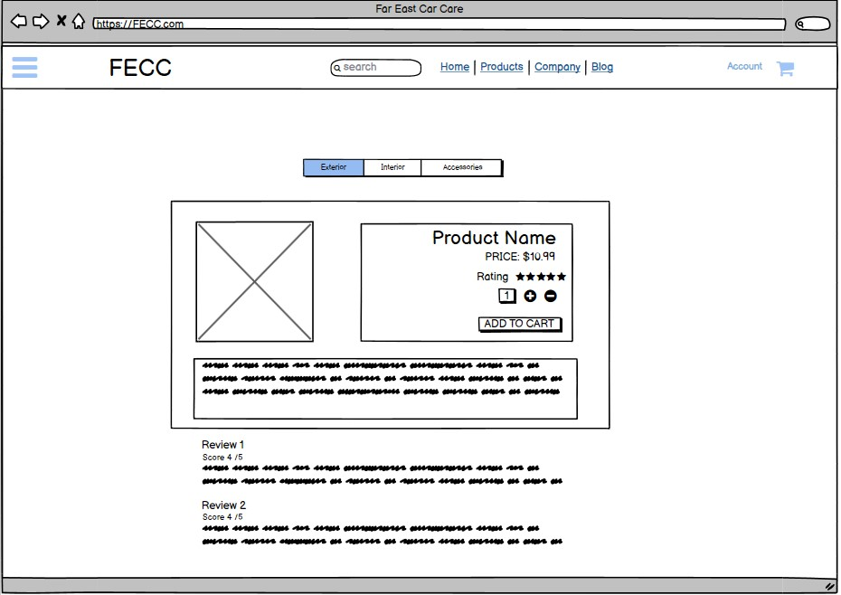

Cart

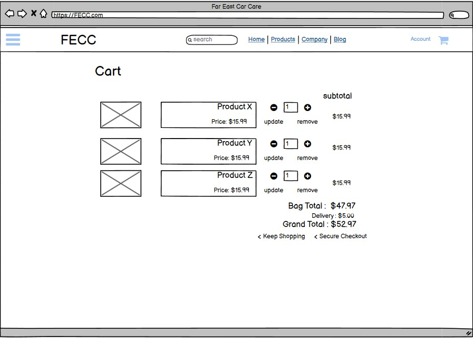

Checkout Page

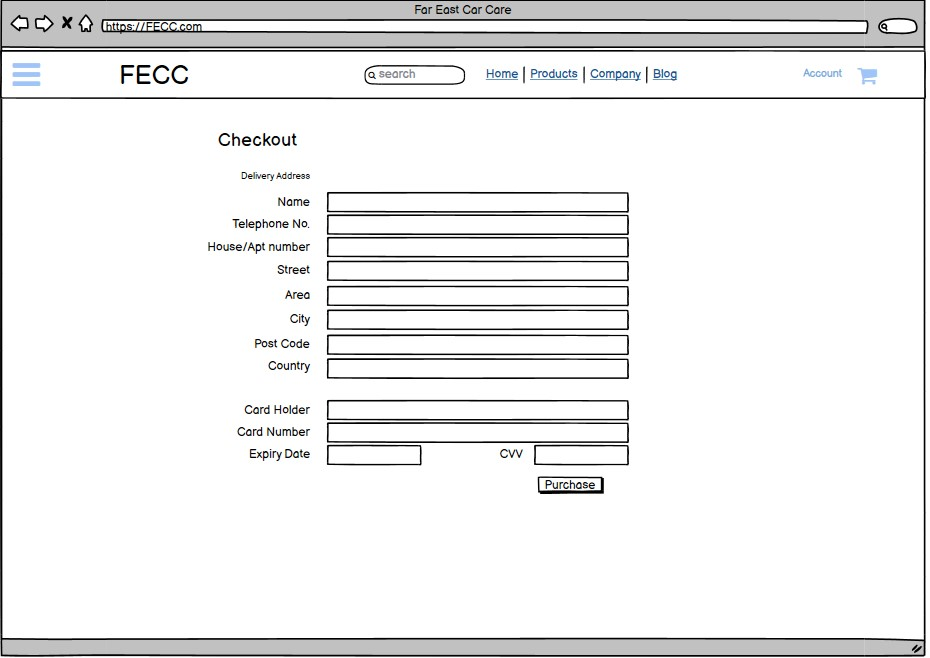

Order Confirmation

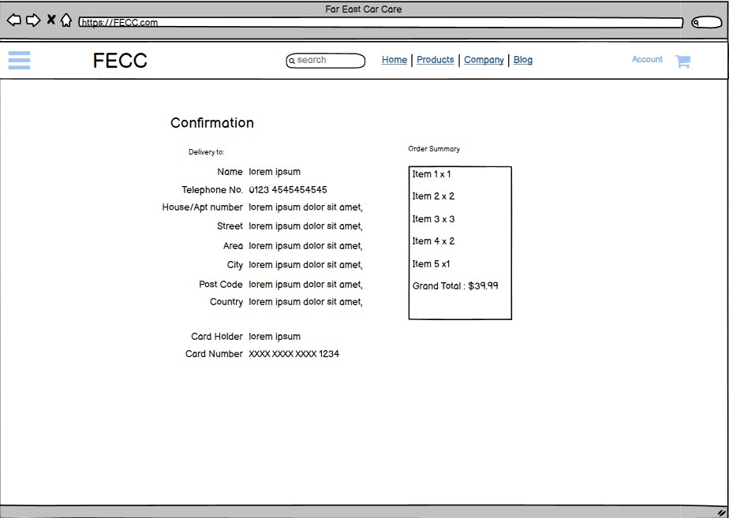

Tablet View

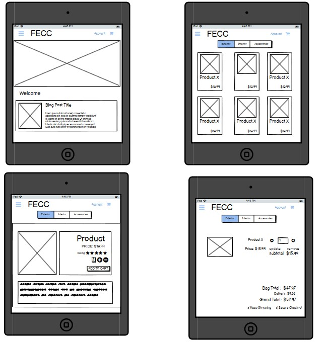

Mobile Phone View

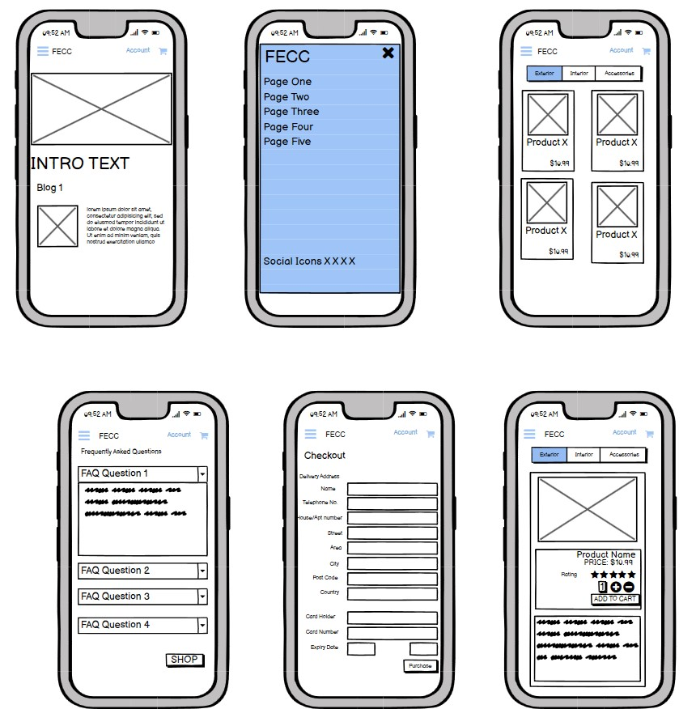

 

[Back to Top :arrow_up:](#table-of-contents)

______
______

# Scope

## Scope of Attributes of the website
 
- Fully controlled user accounts with Username and Password access only.
- Credit Card payment system facilitated by Stripe.
- Presentation of products in a structured fashion with facility to grow the range easily.
- The site will offer a Client feedback and rating system for products and in the Blog.
- Client-specific profile pages with history or transactions are available to registered users. They can update personal data or passwords. 
- The site templates and structure will be underpinned by the Django framework.
- The Databases required will be hosted on Heroku using Heroku Postgres for accessibility. 

## Structure and Layout of the site

- The site is formed with two predetermined factors for the user. 
    - The Content
    - The Navigation of the Content

Landing Page

### Navigating the pages
The Navigation in large screen can be accomplished using either the top menu or the sliding side menu. The side menu is available even when scrolling farther down a page. The site can be navigated by unregistered viewers who can read the blogs or browse the product range. Some services are unavailable to unregistered users though, such as commenting on blog posts or actually purchasing products. Any attempt to do so will redirect them to the login page, where if necessary they can choose to register. 

#### Navigating the Blog 
- Users can search the blog from the Blog list page very easily.  Where a keyword may be present in both the title and the content of the blog, the search result will only return unique pages in the list. 
- The landing page, below the top hero-image, will hold the three featured blogs for the site in mid-page, depending on current marketing campaigns. Toward the end of the page, the latest three blog posts will be listed for people who may have already read the featured posts. 
- The blog list will contain paginated lists of the blog posts. There will be four per page, but a side-column will always show the latest posts as well as the blog search-bar.
- Each blog post will contain a Previous and Next post button with the title of the Post.  
- If not logged in, the visitor will be invited to log in and comment. They can follow through to register from this process easily.  

#### Navigating the Store
- From the landing page, users can initially use the top navigation bar for the store. There is a store search-bar for products only. There is also a navigation link for either  either a hover-on drop-down menu containing three rows of categories to select from, along with a "special offer" product.  Clicking on the Store link will take the user to the all products page with a menu of categories at the top. The first two columns contain the lists of possible product categories, the third column will display which current category the user is browsing in. The drop-down menu is available for medium and large screens, the on-screen categories will be used when viewing in smaller screen sizes. 

#### Store Layout
- In the Products page, each product is listed on a card with 
    - Image, 
    - Product name, 
    - Price,
    - Category 

- Clicking on the desired product shows the product detail; 
    - Image, 
    - Product name, 
    - Price,
    - Category 
    - Average Rating
    - Rate Now Button

 The Product detail will show that the product has achieved an average score of X out of Y reviews. Beneath the product details is the Reviews area where previous clients have left a comment and their own rating on the product.
- To leave a comment and score, the user must have registered and logged in.
- To Add To Cart, the user must also have registered and logged in. They will be directed to do so as the comment or purchase buttons will not be available at this point. 

#### Cart Page
- The cart will list all products selected for purchase. 
- Information displayed will be:
    - Image, 
    - Product name, 
    - Price,
    - Quantity with increment and decrement adjustment
    - Update (save changes) button
    - Delete item button
    - Line Total

The Cart Summary will also display:
    - Subtotal
    - Delivery Charge
    - Grand Total
    - Customer note - If they have not spent more than €50, it will display how much more to spend to reach free delivery threshold
    - Return to Store button
    - Proceed to Checkout Button

#### Allauth
The authentication package used to run the client registration package is Django-Allauth. This addresses authentication, registration, account management with the potential to add 3rd Party Social Media account authentication. At this point the Social Media aspect has not been integrated. Allauth will allow users to change and/or recover passwords, update email addresses and update personal profile information.

#### Checkout Page
The Checkout page will display
    - Delivery Address
    - Any new delivery information can be saved permanently with tickbox
    - Credit Card details request
    - Total to be charged to card

#### STRIPE Payments Facility and Developers tools
The checkout uses Stripe payments for credit card payments. To test the system, the company has provided the following for testing environment
    - Card number 4242 4242 4242 4242
    - Expiry date any future time
    - CVC any 3 digit number

#### Order Success
- Once the user has placed the order, details are received by Stripe for processing and a confirmation will be received by return. 
- Confirmation is sent to the users Email address and is also saved into their Order History section in their Account Profile

## Navigating the Blog
- The main ambit of the Blog section is to provide clients with instructional and semi-technical information regarding the products. Car enthusiasts always appreciate user guides written by knowledgeable, trusted and experienced technicians. The blog entries will reveal industry-insider tips and tricks about how to care for the car and this will appeal to both enthusiasts and professionals with a view or even a strong bias towards the products that can be purchased in the store area. 

- The blog is the main tool for marketing, supported by publishing to social media and email campaigns in the regular Subscription service. Featured blogs are available on the landing page with further links to the most recently published posts also available. 

- Each blog has data attached for metrics. 
    - Author (with avatar)
    - Number of Views
    - Number of Comments
    - Time since the article was published

### Creating Blog Posts

For attractive blog posts, TinyMCE, a third party Rich Text Editor plug in for the Content body of the blog. I installed this to allow for nicer options for formats of text and inserting images into blog posts. Once installed, the project URL and settings files are updated to integrate the editor. Please see the project's build-record.txt file, chapter 53 for details. 

## Database Resources

For hosting Media and Static CSS and Javascript sheets, Amazon Web Services AWS S3 bucket repositories were used. 
Heroku PostgreSQL serves as the secure hosting platform from which the FECC project is deployed. 

 

[Back to Top :arrow_up:](#table-of-contents)

---
---

# Surface 

## The Surface values of the Site

The colour scheme for the site was determined in advance, along with other styling factors such as box-shadowing, font family, style and weight. These were declared as global CSS variables for easy recall. Each variable was prefixed with the project name "--fecc" 

The main color scheme is a variation of blues as primary and greys as secondary colors. For contrast, two shades of red and two shades of green, a yellow and an azure blue are also included. The Font Families were imported from Google Fonts : Roboto and Poppins. Please see the following image for the list of style attributes:  

Landing Page

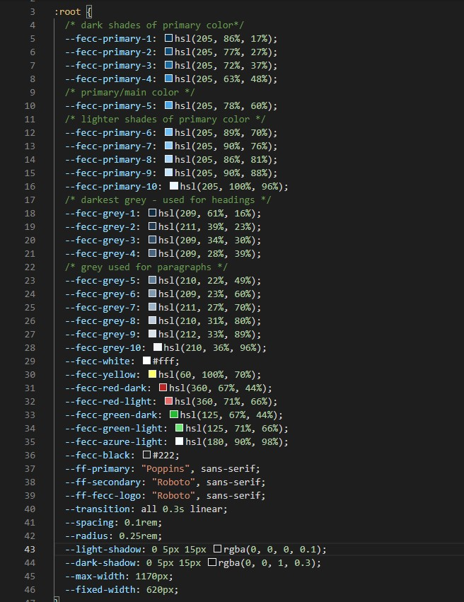

---

# Technologies

## Core Technologies 

#### Integral Languages, Frameworks and Editors

The following technologies were vital in the completion of the project:
- HTML5 - The bones of the website, it is the Markup language that holds everything together in the web browser
- CSS 3 - Style sheet language that calibrates the characteristics of every component, from colour to size to positioning. 
- Javascript - Interpreted high-level programming language. 
- Python 3.8 - the interpreted high level, general-purpose programming language
- Django 3 - A Python program-based open source framework
- Bootstrap 4 - A CSS framework for aiding responsiveness
- Amazon Web Services S3 - Simple Storage Solution for easy store and call of data
- Heroku - a cloud based a Platform as a Service that sits over AWS, enabling deployment for CRUD functionality
- Heroku Postgres - with PostgreSQL, using SQL database-as-a-service for the project
- Gitpod - Collaborative code editor in my browser! 
- Github - Hosting for development and version control
- TinyMCE - A WYSIWIG Rich Text Editor for integration into Django applications
- Travis - Software building and testing support for Github
- FontAwesome - Icon resources.
- Stripe - Credit Card processing service
- Psycopg2 - postgresSQL and python integration
- Django Crispy Forms - Form display tool
- Gunicorn - Multiprocessing of Python WSGI-compliant applications for deployment
- Boto3 - integrates libraries for AWS S3
- Pillow - Python image processing
- Pandas - Dataframe manager to render email lists in a usable format.
- pip3 - used to install all packages in python

 

[Back to Top :arrow_up:](#table-of-contents)

--- 
---
# Testing

- Throughout the creation of this website, the work was continuously recorded and tested. The Build-Record document contains 65 chapters as each part of the site developed and grew. Most chapters contain one or more tests of the event. 

- The User Story document contained the requirements of the site which were also tested for completion of task. 

- The final Testing document contains a list of checks and where needed, fixes for outstanding bugs. 

---

# Deployment

--- 

### Deployment, Cloning or Downloading this project

This Project can be run locally using an IDE such as Visual Studio Code. 

#### Requirements : 
Python 3 - the project is mechanically based on the python language
PIP - install packages using PIP3
Git - version control for your ongoing progress
Stripe - You will need to register an account

Recommended
A virtual environment  : pip3 virtualenv env to install and then create your virtualenv env
python3 -m venv .venv
where .venv is the name/path you are giving to the virtual environment

Process
At the Project Github Repository, Click into the Code and select 'Download Zip'. Proceedd to unzip the files into your preferred directory. 

Alternatively, clone the repository directly using the command

- gh repo clone BXS-Archipelago/far-east-cc-ms4

 cd path/to/your/folder
Activate your virtual environment. If using Python's venv:

 source .venv/bin/activate
on MacOS and Unix where .venv is the name you gave previously

 .venv\Scripts\activate.bat
on Windows where .venv is the name you gave previously

Install all content from the requirements.txt file

- pip3 install -r requirements.txt

Create a file env.py to store environment variables

Add environment variable in the format as shown below and also demonstrated in the sample_env.py file
You will need to create your own variables in the your env.py file. The format is as follows:

 os.environ.setdefault('SECRET_KEY', '<INSERT_KEY_HERE>')
 os.environ.setdefault('DEVELOPMENT', '1')
 os.environ.setdefault('ALLOWED_HOSTS', '<INSERT_VARIABLE_HERE>')
 os.environ.setdefault('STRIPE_PUBLIC_KEY', '<INSERT_VARIABLE_HERE>')
 os.environ.setdefault('STRIPE_SECRET_KEY', '<INSERT_VARIABLE_HERE>')
 os.environ.setdefault('STRIPE_WH_SECRET_CH', '<INSERT_VARIABLE_HERE>')
 os.environ.setdefault('STRIPE_WH_SECRET_SUB', '<INSERT_VARIABLE_HERE>')

* It is advised to follow the extensive documents provided by stripe for developers 

SECRET_KEY value is discretionary. For a secure key please try https://miniwebtool.com/django-secret-key-generator/ 
DEVELOPMENT is set to 1 in settings.py for stable running of the file locally and remotely. 
STRIPE_PUBLIC_KEY and STRIPE_SECRET_KEY values are offered by Stripe when you have your account. 

STRIPE_WH_SECRET value is also obtained from the Stripe website.
Please follow the Stripe guidelines on Webhook API Values

Run the application using : python3 manage.py runserver
Your IDE can operate a Live Server to view the site. 

## Heroku Deployment :

* It is advised to follow the Heroku documentation on deployment.*

* It is advised to follow the AWS S3 documentation for secure storage and access.*

The following is an exerpt from my build-record document to offer guidance on setting up the project with Heroku and AWS S3

- Access heroku.com and create your account.
- Create new app and title it appropriately
- Add-On Heroku Postgres
- Install at terminal : pip3 install dj_database_url
- Secondly, install : pip3 install psycopg2-binary
- Freeze Requirements.txt
- In project settings.py import dj_database_url 
- Comment out original DATABASES block
- Update databases in settings.py with call to dj_database_url.purchase
- Retrieve database_url config var from heroku settings and attach to parse
- Run python3 manage.py showmigrations  
- Show Migrations command reveals the list of migrations that are required. 
- Run python3 manage.py migrate
- Run  python3 manage.py loaddata categories
- Run  python3 manage.py loaddata products
- Create superuser and password
- Remove parsed database config in settings.py and restore original DATABASES.

* Deploying to Heroku *
- in project settings.py use : if 'DATABASE_URL' in os.environ to use as database setting, otherwise use default default.
- As webserver, install :  pip3 install gunicorn
- then : pip3 freeze > requirements.txt
- create new file : Procfile
- In Procfile : web: gunicorn far_east_cc.wsgi:application ; so Heroku can create a web dyno to run unicorn and serve the django app
- At Terminal :  heroku login -i
- At Terminal, disable collecstatic with :
    heroku config:set DISABLE_COLLECTSTATIC=1 --app bxs-fecc-ms4 
- In project settings.py add local host and heroku app hostname to ALLOWED_HOSTS

- After normal git push, initialise heroku git remote if app created in website: heroku git:remote -a project_name_here
- Then : git push heroku main
- Test Heroku App for deployment
- Test result: successful but lack of static files for styling Observed
- In Heroku, connect app to Github and set to automatically deploy whenever a git push occurs
- Use www.https://miniwebtool.com/ to generate a django SECRET key
- Add new key to heroku config variables
- In settings.py, configure the secret key setting to retrieve from environment, using empty string as a default
- Set DEBUG = 'DEVELOPMENT' in os.environ 

* Connect Django to AWS *
- in AWS s3, create new bucket and name appropriately
- in bucket settings, enable static website hosting
- Use the provided CORS configuration: 
[
  {
      "AllowedHeaders": [
          "Authorization"
      ],
      "AllowedMethods": [
          "GET"
      ],
      "AllowedOrigins": [
          "*"
      ],
      "ExposeHeaders": []
  }
]
- Edit Bucket Policy for S3 Bucket Policy, Pricipal *, Action : Get object
- Retrieve ARN from bucket policy editor and paste into policy generator 
- Click Add Statement, then Generate Policy
- Copy Policy and pasted into bucket policy editor
- Add /* onto the end of the resource key to allow access to all resources
- Click Save 
- In Access Control Lists ACL allow everyone access to List Objects

 * Identity Access Management in AWS 
- Access IAM from AWS services dashboard or the history
- First Create Group for the user to reside: manage-fecc-ms4
- then create Policy :  go to the JSON tab, use import managed policy 
- Search for S3FullAccess Policy and import that.
- Open in a separate tab, S3 from the services dropdown. 
- Navigate to bucket policy editor and retrieve ARN 
- Paste ARN into create policy json field replacing the Resource. Use [] here
- Secondly, also include the ARN again but with the /* . The first is the bucket itself, the second is another rule for all files/folders within.
- Click next, (no tags) and next again for Policy naming: bxs-fecc-ms4-policy.
- Give description : "Access to S3 bucket for FECC static files"
- Click Create Policy
- Test for Policies Page, AWS confirms "The policy bxs-fecc-ms4-policy has been created."
- Go to User Groups for "manage-fecc-ms4"
- Under Permissions, click Add Permissions > Attach Policy
- Find the relevant policy (bxs-fecc-ms4-policy) and click Add Permissions
- In Users section, click Add User and name it : fecc-staticfiles-user
- Give Programmatic Access and click next
- Add the Correct user to group and click next to the end
- On the Sucess page, download the CSV file which contains access and secret access keys

* connect Django to AWS *
- installation : pip3 install boto3
- installation : pip3 install django-storages
- Freeze installations : pip3 freeze > requirements.txt
- In project settings.py, add storages to installed apps
- Also in settings, set an IF statement for USE_AWS in the environ to control the bucket, region, access key and secret key.
- In Heroku config vars, add the csv access key and secret key, also remove disable collecstatic
- In settings.py, set the aws custom domain variable to storage bucket name 
- Create new file: custom_storages.py and import django config settings and S3Boto3Storage 
- Create classes for StaticStorage and MediaStorage to inherit from django storages.
- In settings.py, now set the Static and Media Files for the storage classes just created.
- Set the Static and Media file new location URLs to override the URLS in production
- Now Commit Work thus far and issue a git push to deploy into heroku.
- Monitor Activity in build-log in Heroku.  Initial build FAILED due to typo (
    used django.config instead of django.conf to import settings! )
- Test again with git add, commit & push. Build Finalised Successfully. 
- In AWS S3, the static file is now present.
- In the website, the CSS and JS should be functioning. Images to be transferred in. 
- Testing should be carried out at this point

* Handling Media Files *
- In Settings.py add AWS_S3_OBJECT_PARAMETERS in USE_AWS to allow browser to cache static files for extended periods as required
- Commit Work thus far and push into Heroku
- In S3, create a new folder : "media" and upload all images into it
- Test : Login to project page as Admin and verify email address 
- Is the page login used to force allauth to create the email?
- Test Login to admin: Is the Email address observed and verifiable.
- Add Stripe Keys to the Heroku Config Vars : Public and Secret Keys
- Create new Webhook Endpoint for Herokuapp url
- Add the new Webhook signing secret key to Heroku config vars
- Test: Send test Webhook from Stripe
    - Check Webhooks

- Test: Process by processing a dummy order.

Inside your Project Settings.py, the following python block is required: 

if 'USE_AWS' in os.environ:
    AWS_STORAGE_BUCKET_NAME = < Your Bucket Name >
    AWS_S3_REGION_NAME = < Your server location >
    AWS_ACCESS_KEY_ID = os.environ.get('AWS_ACCESS_KEY_ID')
    AWS_SECRET_ACCESS_KEY = os.environ.get('AWS_SECRET_ACCESS_KEY')
    AWS_S3_CUSTOM_DOMAIN = f'{AWS_STORAGE_BUCKET_NAME}.s3.amazonaws.com'
    AWS_DEFAULT_ACL = None

# Static and media files

    STATICFILES_STORAGE = 'custom_storages.StaticStorage'
    STATICFILES_LOCATION = 'static'
    DEFAULT_FILE_STORAGE = 'custom_storages.MediaStorage'
    MEDIAFILES_LOCATION = 'media'
    STATIC_URL = f'http://{AWS_S3_CUSTOM_DOMAIN}/{STATICFILES_LOCATION}/'
    MEDIA_URL = f'http://{AWS_S3_CUSTOM_DOMAIN}/{MEDIAFILES_LOCATION}/'

ALLOWED_HOSTS = ['127.0.0.1', 'project_name.herokuapp.com']

 

[Back to Top :arrow_up:](#table-of-contents)

---
---

# Resources 

---
---

# Credits 

First and Foremost, This Milestone 4 Project was created thanks to the great learning platform and content provided by the Code Institute. While I didn't use much tutor support, when I did need it the tutors were always knowledgable and patient. So a huge credit to the team in Code Institute. Most of this project was built with what I learned from them.

Mr Maranathan Ilesanmi was my Mentor assigned by Code Institute from day 1 and his advice was invaluable. I am very grateful to him for his wisdom and perspective, not to mention his technical knowledge. I wish him all the best for the future. 

For insight on how to approach a django blog build, a YouTube channel "Just Django", run by Mr Matthew Freire from Pretoria in South Africa, provided some very useful elemental processes for me to observe in the project: https://justdjango.com/

### Images 
Some of the photos in the blog website are my own, taken at my workshop. 
Product photos were obtained from the manufacturers of the products Soft99 Corporation Japan and Pika Rain Japan
    - https://www.soft99.co.jp/en/
    - https://pikarain.asia/

There are also some photographs from the free resource Unsplash
    - https://unsplash.com/

# End Of Document

