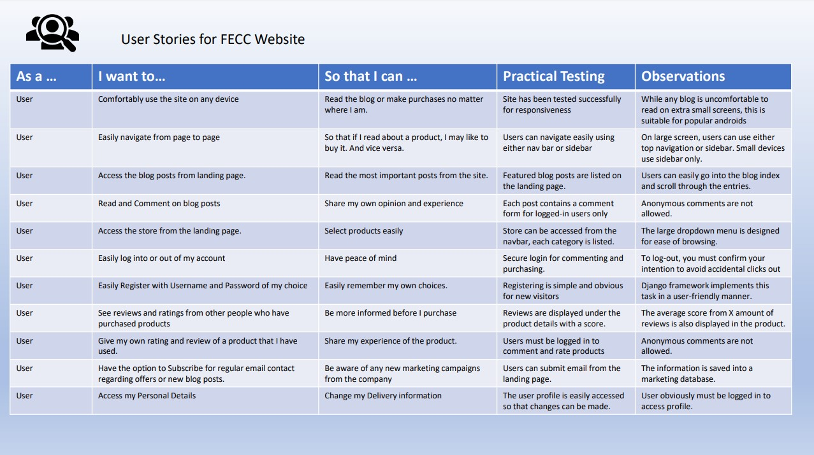
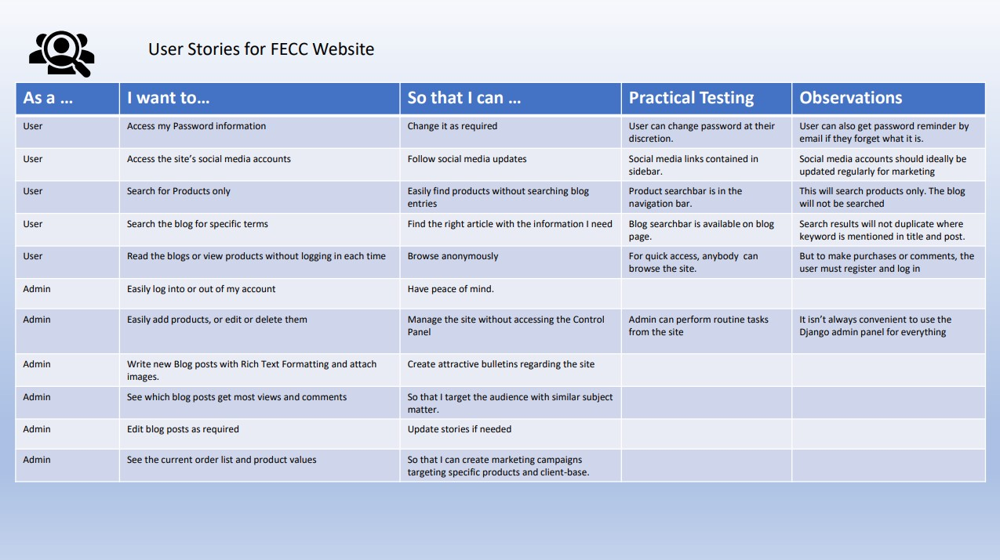

# Milestone Project 4 : Far East Car Care Ltd, an online shopping site proposal for car-care products.

### By: Brian Smyth

## Why should this website exist?

Car care is a strongly growing business at present with a large pool of car enthusiasts as the primary customers, along with a smaller pool of car-care professionals who use products daily. This aspect of the business is strongly both visual and kinesthetic. To elaborate on this, car enthusiasts love beautiful looking cars, it appeals to their visual senses and emotions. Most also enjoy working on their own cars, putting great efforts into mechanical maintenance and care/appearance maintenance. The result is appreciated far more than the personal effort. 

While there are a lot of brands and products available, the most advanced ranges come from the Far East. There is a greater access to industrial grade chemicals from a broader field of innovation, which is pipelined into the automotive product sector. Their products are easier to use, more durable and look better than most European or American brands. The greatest obstacle to the car enthusiast based in Europe or USA is that they can't speak nor read Japanese, so the translation of product labels provides a huge barrier to purchasing. 

Too make it easier for the average enthusiast, this website will provide easy access to a range of Japanese car products which are of high quality and easily understood in their purpose. The website will be mainly a business-to-consumer website with an easy to follow categorisation of products. Users will be easily able to browse and select products by adding them to a shopping cart where they can then make a credit-card purchase through a secure online-purchase resource. The products will then be dispatched within 24 hours. 

Ancillary objectives for the site owners will be to offer an email subscription service with tips and tricks for product use, special offers and a feature for new/coming-soon product developments. 

## UX : Strategic approach for the site's User Experience: 

The site will entice the users through educational and instructional blog posts along with images of cars that have the site's products used on them. First and foremost, there must be both visual and educational appeal set apart from the actual products in the store. 

Upon landing on the index page, the user will be introduced with an attractive car image at the top, along with some featured blog posts in the main body of the page. There will be links to the store both in the body and at both the top navigation bar and the always-present sliding side navigation. 

Adjuvant site pages will be the Blog and posts pages, the About page, the Frequently Asked Questions, and the Contact page.

Site Navigation will be through a side-sliding menu on the left. The Icon actuator will be clearly visible at the top right of the page for the user to click on.

On mobile devices, the sliding navigation bar will the main tool for traversing the site, however the account button (to login or register) and the cart will always be available in the top right of every device.

## Who are the target Users?

 - The natural funneling within the true hands-on car-enthusiast groupage is probably more than 90% male (from experience, with no official data recorded that can be found). 
 - The target age-group for customers of the website is 18 to 70 years old as car lovers always enjoy working on their cars, regardless.
 - Car Wax Enthusiasts, who are actually a subset of car enthusiasts with large collections of car care products in their garages.
 - Detailing & Car Care Hobbyists - those who spend their weekends cleaning and polishing their family's and friend's cars for extra income. 
 - Average Car Owners, the owners who prefer to wash and wax their own cars without necessarily being enthusiastic about the engine or performance. 
 - Car Detailing & Valeting Professionals who use quality products on their clients' cars. 
 - Motorcycle Enthusiasts, as they also like to keep their bikes pristine.
 - Truck Enthusiasts.
 - Spouses and Relatives of Car Enthusiasts who may wish to purchase gifts. 
 
## Research 

- There are a handful of small business who sell a broad range of car care products online.
- There are also larger Bulk chemical companies who specialise in car trade product sales, for dealers and car-wash centres, etc.
- There is a very small supply of Japanese products and some of these are low quality. 
- Most car owners are ignorant of car care products, the quality of them and what they are actually designed to do. 
- Most products are bought in general because of the marketing and merchandising on chain-store shelves. 
- Most products are bought because they are cheap.
- Car enthusiasts are more likely to discuss and compare products at social gatherings, car club meets, car shows. 
- Enthusiasts will share photos of their cars and product purchases on Social Media.
- Ease-of-use and the finish delivered by the product are more important than competitive pricing. 

## Important Site Features for the users

- The Blog will contain posts created in categories such as News, Tips & Tricks, Products, Professional Advice, Special Offers. 
- Blog Posts will allow registerd users to leave comments. 
- Each post will display Number of Views, Number of Comments, When it was written. 
- User Accounts : Create Unique login and password for returning clients
- Securely stored customer data : Address and billing information
- Ability to edit data such as name, address, telephone, email in the account.
- Secure Financial Transactions 
- Ability to browse products and Read pertinent data
- A shopping cart to Update with planned purchases
- Company information Page
- Frequently Asked Questions
- A resource to submit queries
- A Subscription for regular updates and offers
- The ability to update 
- A Product rating system
- A list of reviews from other customers on each product. 
- Real-time confirmation of actions such as "Added to Cart", "Item Deleted", etc
- On non-store pages, a Call-To-Action link as an eye-catching animated button.
- The ability access products by pre-selected category (Exterior, Interior, Accessory products, etc)
- The ability to select or filter products by price. 
- A convenient Search utility.
- Social Media links
- Shopping Cart button link
- The ability to subscribe to the newsletter without having an account
- Buttons to keep shopping after adding to cart or viewing the cart

## Business Goals for the site

- The site owner purchases in bulk and sells individual items at a profit
- The site and products will be marketed on Social Media
- The service will be more attractive than local competitors through ease of access, after-sales support, pre-sales advice and frequent blog posts.  
- Products will be dispatched efficiently, attractively and safely wrapped and securely boxed with invoice and address paperwork attached to the exterior.
- The business will strive for positive feedback, both for products and service.

## User Story Aspirations

## Scope of Attributes of the website
 
- Fully controlled user accounts with Username and Password access only.
- Credit Card payment system facilitated by Stripe.
- Presentation of products in a structured fashion with facility to grow the range easily.
- The site will offer a Client feedback and rating system for products and in the Blog.
- Client-specific profile pages with history or transactions are available to registered users. They can update personal data or passwords. 
- The site templates and structure will be underpinned by the Django framework.
- The Databases required will be hosted on Heroku using Heroku Postgres for accessibility. 

## Structure and Layout of the site

- The site is formed with two predetermined factors for the user. 
    - The Content
    - The Navigation of the Content

### Navigating the pages
The Navigation in large screen can be accomplished using either the top menu or the sliding side menu. The side menu is available even when scrolling farther down a page. The site can be navigated by unregistered viewers who can read the blogs or browse the product range. Some services are unavailable to unregistered users though, such as commenting on blog posts or actually purchasing products. Any attempt to do so will redirect them to the login page, where if necessary they can choose to register. 

#### Navigating the Blog 
- Users can search the blog from the Blog list page very easily.  Where a keyword may be present in both the title and the content of the blog, the search result will only return unique pages in the list. 
- The landing page, below the top hero-image, will hold the three featured blogs for the site in mid-page, depending on current marketing campaigns. Toward the end of the page, the latest three blog posts will be listed for people who may have already read the featured posts. 
- The blog list will contain paginated lists of the blog posts. There will be four per page, but a side-column will always show the latest posts as well as the blog search-bar.
- Each blog post will contain a Previous and Next post button with the title of the Post.  
- If not logged in, the visitor will be invited to log in and comment. They can follow through to register from this process easily.  

#### Navigating the Store
- From the landing page, users can initially use the top navigation bar for the store. There is a store search-bar for products only. There is also a navigation link for either  either a hover-on drop-down menu containing three rows of categories to select from, along with a "special offer" product.  Clicking on the Store link will take the user to the all products page with a menu of categories at the top. The first two columns contain the lists of possible product categories, the third column will display which current category the user is browsing in. The drop-down menu is available for medium and large screens, the on-screen categories will be used when viewing in smaller screen sizes. 

#### Store Layout
- In the Products page, each product is listed on a card with 
    - Image, 
    - Product name, 
    - Price,
    - Category 

- Clicking on the desired product shows the product detail; 
    - Image, 
    - Product name, 
    - Price,
    - Category 
    - Average Rating
    - Rate Now Button

 The Product detail will show that the product has achieved an average score of X out of Y reviews. Beneath the product details is the Reviews area where previous clients have left a comment and their own rating on the product.
- To leave a comment and score, the user must have registered and logged in.
- To Add To Cart, the user must also have registered and logged in. They will be directed to do so as the comment or purchase buttons will not be available at this point. 

#### Cart Page
- The cart will list all products selected for purchase. 
- Information displayed will be:
    - Image, 
    - Product name, 
    - Price,
    - Quantity with increment and decrement adjustment
    - Update (save changes) button
    - Delete item button
    - Line Total

The Cart Summary will also display:
    - Subtotal
    - Delivery Charge
    - Grand Total
    - Customer note - If they have not spent more than €50, it will display how much more to spend to reach free delivery threshold
    - Return to Store button
    - Proceed to Checkout Button

#### Checkout Page
The Checkout page will display
    - Delivery Address
    - Any new delivery information can be saved permanently with tickbox
    - Credit Card details request
    - Total to be charged to card

### STRIPE Payments Facility and Developers tools
The checkout uses Stripe payments for credit card payments. To test the system, the company has provided 

#### Allauth
The authentication package used to run the client registration package is Django-Allauth. This addresses authentication, registration, account management with the potential to add 3rd Party Social Media account authentication. At this point the Social Media aspect has not been integrated. Allauth will allow users to change and/or recover passwords, update email addresses and update personal profile information.

