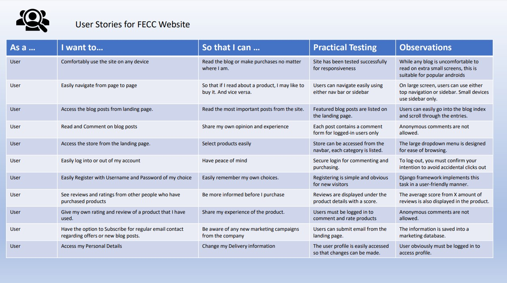
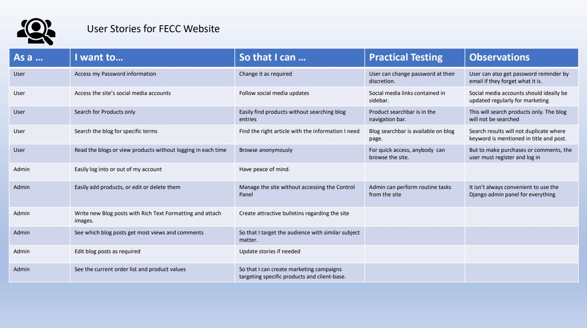

# Project Testing 

#### Testing was completed at three points in the project. Throughout the creation of the website, each step was documented and every stage was tested and noted for progress or potential bugs. This amounted to over 62 chapters in the build-record.md document. 

---

#### Secondly, testing was documented according to the user stories using the format "As a User" or "As an Admin" , "I want to.." , "So that I can..." with test results and observations. Please see the two images below for these: 

User Story 1

User Story 2

---
---

During the build, there were some changes made for better site performance or simply because some directions were not working out. For example, I initially wanted the landing page to have a video background with JS play and pause button. However, even though it was very appealing it was a little too demanding for the site. Also, in spite of following directions for the django-star-rating app, it would not work out for me. And this seemed to be a common point among peers in Stack Overflow. With the very limited documentation and support for the module, I deferred to using a simple numeric rating system for the products instead. 

#### The final testing for the site is the pre-submission, fine-toothed comb manual testing of functionality and features. 

---

# Final Testing 

#### Navigation Links : 

Test of all the following links : 

- Home 
- Blog
- Store
- Help
- FAQ
- About
- Contact
- Account
- Login
- Register
- Product Manager
- Create Blog
- My Profile
- Logout
- Shopping Cart 

#### Links test result : Successful - All links redirect to the correct page. 
---
---
- Sliding Side-Navigation Bar
    - Burger-Bars Actuator 
    - Home
    - Store
    - Blog
    - About
    - FAQ
    - Contact
    - X to close 

#### Links test result : Successful - Sidebar links redirect to the correct page and buttons perform as desired.
---
---
- Top Search bar in navigation 

#### Search function test : Successful

- Sidebar Search 

#### Search function test : Successful

---
---
- Test Landing page Buttons - Visit Store and Visit Blog 
    - Test Successful

- Blog Features links 
    - Test Successful : all three links work

- Test Feature blog data :
    - Timestamp, Number of comments : Test successful

- Mid-page Hero link to All Products in Store
    - Test Successful

- Landing page latest Blogs links 
    - Links repaired and now work successfully

- Gallery photos open in new page - successfull

---
---

#### Testing Admin pages from addresses while not logged in. 
- Test Add Products in Product Manager
    - Test result successful

- Test Create Blog 
    ** Test Failed - Needed to add @login_required decorators to view. 
    - Test 2 Successful
- Test Create Email 
    ** Test Failed - Needed to add @login_required decorators to view. 
    - Test 2 Successful 

- Test Access Profile 
    - Test Successful, redirected to login instead

- Test Access Control Panel
    - Test Successful, redirect to django login

---
---

### Test Registration 

#### Test 
- Register button & registration appears.
    - Using Temp Email : kihosip198@busantei.com 
    - Username : testing123
    - Password : fecctest123

- Test result: Successful
    - Upon clicking submit, the screen switched to confirm-email and message flashed that a confirmation email has been sent to the email address. 
    - The Email was received and contained the link to confirm the email. Upon clicking, a new page opened to confirm receipt and to now log in with Username and password. 

### Test Login

#### Test
- The Account link in the navbar offers the drop-down for log-in. This works.
    - The Sign In page opens requesting username and password. 
    - Using above Username and Password, the process was very easy. Flash message for Successfully signed in as Testing123

---
---

### Test Profile

#### Test
- The Account link in the navbar offers the drop-down for Profile. This works.
    - The Profile page opens with a blank sheet for delivery information and also blank order history. 
    - Entering an address and clicking Update information displays the Success Message. 
    - This address will be changed later as Iceland is selected instead of Ireland

---
---

### Test Products and Rate/Review
The Store dropdown menu offers full category selection to choose from. Picking all-products will also give an on-page selection of product categories. 
    - All links work. 
    - Selecting "Pika Pika Rain Shampoo" to review. It is currently at Score: 0/5 in 0 Reviews. 
    - Rate Now button takes me to the review page. 
    - A brief review with a Rating of 4 is performed. 
    - I am brought back to the product detail page where the review sections says Score: 4.0/5 in 1 Reviews
    - Below contains the review text, with reviewer's name and the rating they gave. 

---
---

### Test Products Purchase
    - Increased quantity to 2. Clicked Add To Cart
    - Success Message appears with summary of cart 
        Test Fail : Product name is not appearing in the Success message. 
        Toast Success Template contained {{ item.product_name }} but should be {{ item.product.name }}
        
        - Test 2 Result - Success
    - Clicking into Shopping Cart, the item is listed for quantity of 2. Changing this to 1 using decrement and update buttons. 
    - Success Message appears with bright notice that I should spend another €20.01 to get free delivery
    - Free delivery notice also appears within the Shopping Cart page as would normally appear when purchasing a low-value item.
    - Clicking into Secure Checkout from Toast message does nothing. The link was set to cart instead of checkout. 
        - Test 2 - link fixed and immediate access to checkout page. 

    - In Checkout, it is observed that my earlier provided default information is not displayed as hoped. 
    - Continuing with purchase to check if address now provided is saved as default for future 
    - In providing the Stripe test credit card number the order is processed successfully and I am taken to the checkout-success page
    - Checkout-success initially displays the Success toast message that the order is processed, the order number and that an email has been send to my email address. 
    - In Checking my email, the actual order confirmation has been received with full correct information
    - The Checkout Success page gives the same information on screen. 

        - The new address from the order has been saved to My Profile.
        - Updating the street address and country in My Profile, the new information saves. 
        - Testing with new order again - new order does not contain Profile default address. 
        - Investigation found that my Checkout view in checkout>views.py was missing some code. It is now updated to check if the user is authenticated, and if so to grab the profile address, and if not to render an empty form. 
    
    - Checkout Testing now completed successfully. 

---
---

### Testing Product Management

#### Test 
- The account link provides drop down for Admin user to select Product Manager
    - Link works for Product Management Page
    - Choosing an empty category : Dress & Protect
    - Uploading product name, description, image and price.
    - Product saves with success message displayed.
    - Test as Admin, Edit by changing price and description Successfully
    - Test as Admin, Delete successfully in one click. 
    - Create product again successfully.
    - ALL CRUD functions working. 

---
---

### Test Create Blog 

#### Test
- The account link provides drop down for Admin user to select Create Blog
    - The Input page contains Title, Overview, Content, Thumbnail (image upoad), Categories, 
    Featured Tickbox, Previous Post and Next Post selections. 
    - The Content box uses a Rich Text Editor which allows me to edit font size and style as well as inserting images and active links. 
    - The blog post saves and displays extra data such as Author name & Avatar, number of views, number of comments and time since it was created. 
    - As Admin, the Post can be edited for any of the input criteria
    - As Admin, the Post can be deleted in one click. 
    - All CRUD functions working. 

        - Test Commenting on Blog posts 
            Comment is unavailable to users not logged in
            When logged in, users write into an input text box and submit. 
            Their username is displayed
            The comment count is incremented. 
            The time is noted and time since created is displayed
            By design, the users are not allowed to edit or delete their comments. 

---
---

### Test Email Marketing & Subscription Service

#### Test
- The landing page contains the Subscription Form. 
    - Entering and submitting an email address gives a success message. 
    - The email is saved to the database as displayed in the control panel

- The account link provides drop down for Admin user to select Create Email
    - The page link directs to the email creating page. 
    - There are three components 
        - Title
        - Message
        - Send Message

    - The function created in the marketing views.py uses pandas to create a usable library of email addresses derived from the database. 
    - Once the Title and Message are formulated, clicking Send Message distributes the email to all addresses kept. 
    - To test, I input three separate email addresses as a subscriber. 
    - Test result : Successful, all three Inboxes received the mail shot instantaneously. 

# End Document

